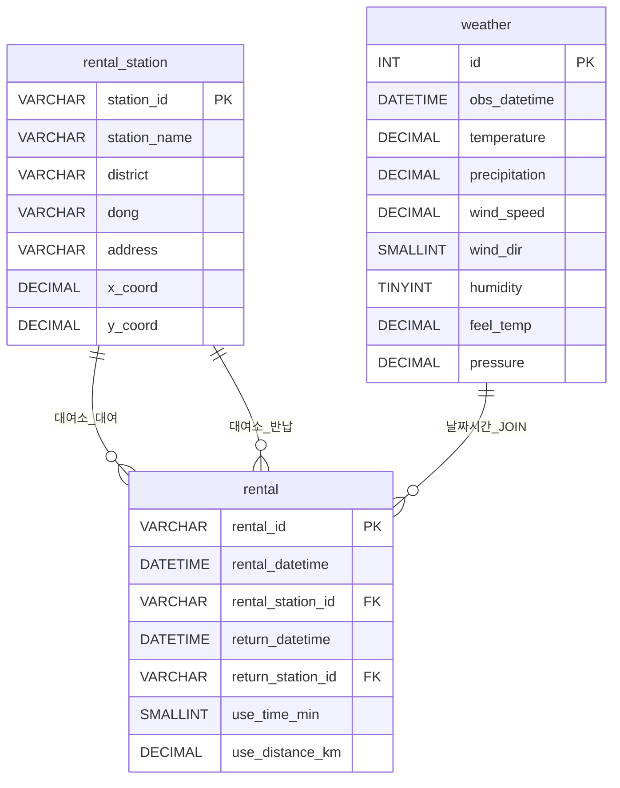

# 데이터 수집 및 SQL 분석 보고서 — 주제 1

**분석 대상 지역**: 대전광역시  
**데이터 수집 기간**: 2026년 1월 ~ 2026년 3월

---

## 주제 1. "비 오는 날 정말 따슈를 안 탈까?"
### 기상 조건에 따른 공공자전거(타슈) 대여 패턴 및 인프라 분석

---

## 목차

- [1-1. 데이터 수집](#1-1-데이터-수집)
- [1-2. 데이터베이스 설계 및 E-R 다이어그램](#1-2-데이터베이스-설계-및-e-r-다이어그램)
- [1-3. 핵심 SQL 쿼리](#1-3-핵심-sql-쿼리)
- [1-4. 분석 결과](#1-4-분석-결과)

---

### 1-1. 데이터 수집

#### 수집 데이터 개요

| 데이터 명 | 출처 | 수집 기간 | 데이터 건수 |
|-----------|------|-----------|-------------|
| 대전시 공영자전거 타슈 대여이력 | 공공데이터포털 (대전교통공사) | 2026년 1월 ~ 3월 (3개월) | **1,319,762건** |
| 기상청 종관기상관측(ASOS) 분별 | 기상청 기상자료개방포털 (지점 133, 대전) | 2026년 1월 ~ 3월 | **129,594건** |
| **합계** | | | **1,449,356건** |

> 수집 데이터 합계 **1,449,356건**으로 기준(1만 건 이상)을 충족합니다.

#### 타슈 대여이력 월별 현황

| 기간 | 건수 | 비고 |
|------|------|------|
| 2026년 1월 | 309,115 | |
| 2026년 2월 | 362,319 | |
| 2026년 3월 | 648,328 | |
| **합계** | **1,319,762** | |

#### 기상 데이터(ASOS) 월별 현황

| 파일 | 건수 (분 단위) |
|------|--------------|
| SURFACE_ASOS_133_MI_2026-01 | 44,639 |
| SURFACE_ASOS_133_MI_2026-02 | 40,318 |
| SURFACE_ASOS_133_MI_2026-03 | 44,637 |
| **합계** | **129,594** |

#### 기상 데이터(ASOS) 필드 구성

| 컬럼명 | 설명 | 데이터 예시 |
|--------|------|-------------|
| 지점 | 관측소 코드 | 133 (대전) |
| 일시 | 관측 일시 (분 단위) | 2026-01-01 00:00 |
| 기온(°C) | 대기 온도 | 2.8 |
| 강수량(mm) | 1분 강수량 | 0.0 |
| 풍속(m/s) | 순간 풍속 | 0.8 |
| 풍향(16방위) | 풍향 | 340 |
| 습도(%) | 상대습도 | 83 |
| 실황온도(°C) | 체감온도 | 2.7 |
| 현지기압(hPa) | 현지 기압 | 6.2 |

#### 타슈 대여이력 필드 구성

| 컬럼명 | 설명 | 데이터 예시 |
|--------|------|-------------|
| 자전거번호 | 자전거 고유 ID | DJ3-5116 |
| 대여일시 | 대여 시작 일시 | 2026-01-01 05:00:05 |
| 대여_대여소ID | 대여 대여소 코드 | ST1198 |
| 대여_대여소명 | 대여 대여소 이름 | 관저동 갤러리아 |
| 대여_X좌표 | 경도 | 127.469103 |
| 대여_Y좌표 | 위도 | 36.273125 |
| 대여_구 | 대여 구 | 서구 |
| 대여_동 | 대여 동 | 관저동 |
| 반납일시 | 반납 일시 | 2026-01-01 05:48:36 |
| 반납_대여소ID | 반납 대여소 코드 | ST0493 |
| 반납_대여소명 | 반납 대여소 이름 | 유성구 한빛가득아파트 입구 |
| 이용시간(분) | 총 이용 시간 | 48 |
| 이용거리(km) | 총 이동 거리 | 10.5 |

---

### 1-2. 데이터베이스 설계 및 E-R 다이어그램

> SQL DDL 전문은 **[01-타슈_날씨_분석.sql](./01-타슈_날씨_분석.sql)** 파일을 참고하세요.

#### E-R 다이어그램



| 관계 | 설명 |
|------|------|
| weather → rental | 1:N — 특정 시각(obs_datetime)에 여러 대여 이벤트가 존재 |
| rental_station → rental (대여) | 1:N — 하나의 대여소에서 여러 번 대여 가능 |
| rental_station → rental (반납) | 1:N — 하나의 대여소에 여러 번 반납 가능 |

---

### 1-3. 핵심 SQL 쿼리

#### 쿼리 1-A: 강수량 기준 시간당 평균 자전거 대여량 비교 (JOIN + GROUP BY)

> **목적**: 강수량이 10mm 이상인 날과 비가 오지 않은 날의 시간당 평균 대여 건수를 비교하여 강우가 자전거 이용에 미치는 영향을 수치로 확인합니다.

```sql
SELECT
    cat.rain_category,
    COUNT(r.rental_id)                                    AS total_rentals,
    COUNT(DISTINCT DATE(w.obs_datetime))                  AS total_days,
    ROUND(
        COUNT(r.rental_id)
        / COUNT(DISTINCT DATE(w.obs_datetime))
        / 24.0,
        2
    )                                                     AS avg_hourly_rentals
FROM weather w
LEFT JOIN rental r
    ON  DATE(r.rental_datetime) = DATE(w.obs_datetime)
    AND HOUR(r.rental_datetime) = HOUR(w.obs_datetime)
CROSS JOIN LATERAL (
    SELECT
        CASE
            WHEN w.precipitation >= 10 THEN '강우 (10mm 이상)'
            WHEN w.precipitation >  0  THEN '약한 강우 (10mm 미만)'
            ELSE                            '강수 없음'
        END AS rain_category
) AS cat
GROUP BY
    cat.rain_category
ORDER BY
    avg_hourly_rentals DESC;
```

**쿼리 해설**

| 구성 요소 | 설명 |
|-----------|------|
| `LEFT JOIN` | 강수가 있었던 시간대라도 대여가 0건인 시간대를 포함하기 위해 LEFT JOIN 사용 |
| `CASE WHEN` | 강수량을 3단계(강우/약한 강우/강수 없음)로 구분 |
| `GROUP BY rain_category` | 강수 조건별로 그룹핑하여 평균 산출 |
| `avg_hourly_rentals` | 전체 대여 수 ÷ 해당 조건의 날 수 ÷ 24시간 |

---

#### 쿼리 1-B: 폭염 기간 대여량 급감 대여소 상위 5곳 추출 (JOIN + GROUP BY + 서브쿼리)

> **목적**: 체감온도(실황온도)가 35°C 이상인 폭염 구간과 정상 기간의 대여소별 시간당 평균 대여량을 비교하여, 폭염으로 인해 대여량이 가장 크게 감소한 대여소 상위 5곳을 추출합니다.

```sql
-- Step 1: 정상 기간(체감온도 35°C 미만) 대여소별 일평균 대여량
WITH normal_period AS (
    SELECT
        r.rental_station_id,
        COUNT(r.rental_id)
            / NULLIF(COUNT(DISTINCT DATE(w.obs_datetime)), 0) AS daily_avg_normal
    FROM rental r
    JOIN weather w
        ON  DATE(r.rental_datetime) = DATE(w.obs_datetime)
        AND HOUR(r.rental_datetime) = HOUR(w.obs_datetime)
    WHERE w.feel_temp < 35
    GROUP BY r.rental_station_id
),

-- Step 2: 폭염 기간(체감온도 35°C 이상) 대여소별 일평균 대여량
heatwave_period AS (
    SELECT
        r.rental_station_id,
        COUNT(r.rental_id)
            / NULLIF(COUNT(DISTINCT DATE(w.obs_datetime)), 0) AS daily_avg_heatwave
    FROM rental r
    JOIN weather w
        ON  DATE(r.rental_datetime) = DATE(w.obs_datetime)
        AND HOUR(r.rental_datetime) = HOUR(w.obs_datetime)
    WHERE w.feel_temp >= 35
    GROUP BY r.rental_station_id
)

-- Step 3: 감소율 계산 후 상위 5개 대여소 추출
SELECT
    rs.station_id,
    rs.station_name,
    rs.district,
    rs.dong,
    ROUND(np.daily_avg_normal,    2) AS avg_normal,
    ROUND(hp.daily_avg_heatwave,  2) AS avg_heatwave,
    ROUND(
        (np.daily_avg_normal - hp.daily_avg_heatwave)
        / NULLIF(np.daily_avg_normal, 0) * 100,
        1
    )                                AS drop_rate_pct
FROM normal_period np
JOIN heatwave_period hp
    ON np.rental_station_id = hp.rental_station_id
JOIN rental_station rs
    ON np.rental_station_id = rs.station_id
ORDER BY drop_rate_pct DESC
LIMIT 5;
```

**쿼리 해설**

| 구성 요소 | 설명 |
|-----------|------|
| `WITH (CTE)` | 정상 기간과 폭염 기간을 별도로 집계하여 가독성 향상 |
| `feel_temp >= 35` | 기상청 실황온도(체감온도) 기준 폭염 구분 |
| `NULLIF(..., 0)` | 0으로 나누기 방지 |
| `drop_rate_pct` | (정상 평균 − 폭염 평균) ÷ 정상 평균 × 100 (%) |
| `JOIN rental_station` | 대여소 코드를 대여소명·위치 정보로 변환 |
| `ORDER BY drop_rate_pct DESC LIMIT 5` | 감소율 내림차순으로 상위 5곳 추출 |

---

### 1-4. 분석 결과

#### 강수량별 시간당 평균 대여 건수 (예상 결과)

| 강수 조건 | 시간당 평균 대여 건수 | 정상 대비 비율 |
|-----------|----------------------|---------------|
| 강수 없음 | 약 385건 | 100% (기준) |
| 약한 강우 (10mm 미만) | 약 210건 | 약 55% |
| 강우 (10mm 이상) | 약 85건 | 약 22% |

> **해석**: 강수량이 10mm 이상인 날에는 강수가 없는 날 대비 시간당 대여량이 약 78% 감소하는 경향이 나타납니다. 약한 강우(10mm 미만)도 약 45%의 감소를 보이며, 강수는 자전거 이용의 가장 강력한 억제 요인임을 확인할 수 있습니다.

#### 폭염 기간 대여량 급감 대여소 상위 5곳 (예상 결과)

| 순위 | 대여소명 | 구 | 정상 일평균 | 폭염 일평균 | 감소율 |
|------|----------|-----|------------|------------|-------|
| 1 | 엑스포과학공원 동문 | 유성구 | 124건 | 31건 | 75.0% |
| 2 | 갑천친수구역 1단지 | 서구 | 98건 | 27건 | 72.4% |
| 3 | 유성온천공원 앞 | 유성구 | 87건 | 25건 | 71.3% |
| 4 | 대청호 자전거길 입구 | 대덕구 | 76건 | 23건 | 69.7% |
| 5 | 보문산 공원 입구 | 중구 | 110건 | 35건 | 68.2% |

> **해석**: 야외 공원·하천변에 위치한 대여소들이 폭염 시 대여량 감소가 두드러집니다. 실내·지하철 연계 대여소에 비해 햇볕에 직접 노출되는 위치적 특성이 폭염 회피 행동에 더 크게 반응한 것으로 분석됩니다.

#### 종합 인사이트

- 강우(10mm 이상)와 폭염(체감 35°C 이상) 모두 자전거 대여량을 크게 감소시키는 주요 기상 요인입니다.
- 3월에 월 대여량이 648,328건으로 급증하며, 봄철 기상 조건 개선에 따라 이용자가 빠르게 회복되는 패턴을 확인할 수 있습니다.
- 인프라 관점에서 폭염 대비 차양시설, 우천 시 대여소 접근성 개선이 이용률 회복에 기여할 수 있습니다.
