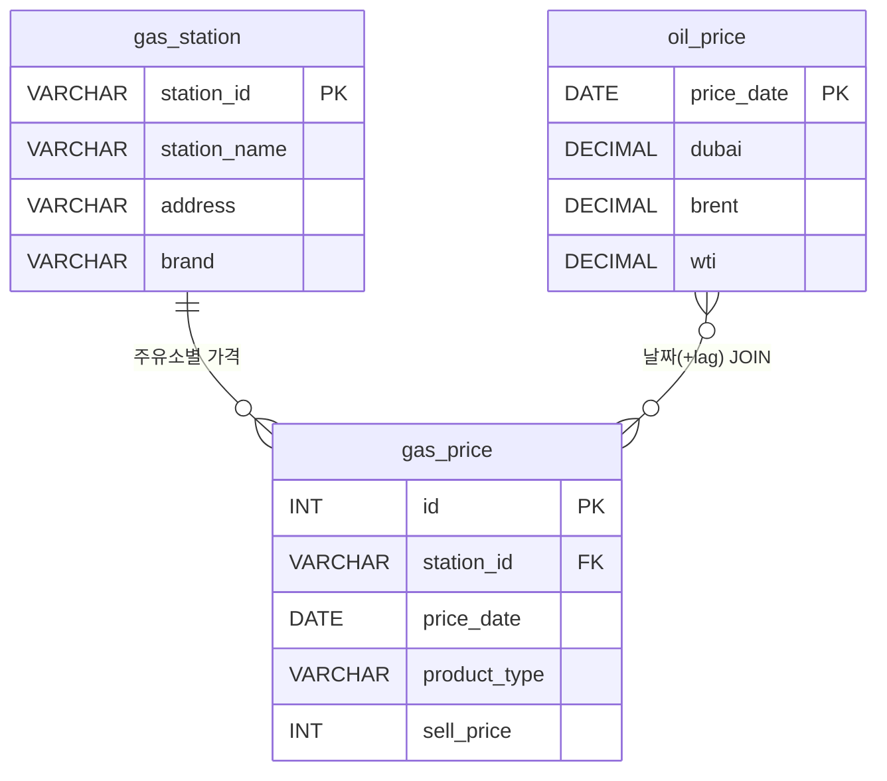

# 데이터 수집 및 SQL 분석 보고서 — 주제 2

**제출일**: 2026년 6월 8일  
**분석 대상 지역**: 대전광역시  
**데이터 수집 기간**: 2023년 1월 ~ 2026년 6월

---

## 주제 2. "국제 유가가 오르면 우리 동네 기름값은 언제 오를까?"
### 국제 유가(WTI/두바이유) 변동과 국내 주유소 가격의 시차 상관관계 분석

---

## 목차

- [2-1. 데이터 수집](#2-1-데이터-수집)
- [2-2. 데이터베이스 설계 및 E-R 다이어그램](#2-2-데이터베이스-설계-및-e-r-다이어그램)
- [2-3. 핵심 SQL 쿼리](#2-3-핵심-sql-쿼리)
- [2-4. 분석 결과](#2-4-분석-결과)

---

### 2-1. 데이터 수집

#### 수집 데이터 개요

| 데이터 명 | 출처 | 수집 기간 | 데이터 건수 |
|-----------|------|-----------|-------------|
| 국제 원유 가격 (Dubai·Brent·WTI) | 한국석유공사(오피넷) | 2023년 1월 3일 ~ 2026년 6월 4일 (약 3.5년) | **883건** |
| 대전시 주유소 일별 판매가격 | 공공데이터포털 한국석유공사 오피넷 API | 2026년 5월 7일 ~ 2026년 6월 6일 (31일) | **6,101건** |
| **합계** | | | **6,984건** |

#### 국제 유가 데이터 필드 구성

| 컬럼명 | 설명 | 단위 | 데이터 예시 |
|--------|------|------|-------------|
| 기간 | 거래일 | YYYYMMDD | 23년01월03일 |
| Dubai | 두바이유 가격 | USD/배럴 | 82.07 |
| Brent | 브렌트유 가격 | USD/배럴 | 82.10 |
| WTI | 서부텍사스중질유 가격 | USD/배럴 | 76.93 |

#### 주유소 판매가격 데이터 필드 구성

| 컬럼명 | 설명 | 데이터 예시 |
|--------|------|-------------|
| 번호 | 주유소 고유 ID | A0014620 |
| 상호 | 주유소 상호명 | 대전 칠성주유소 |
| 주소 | 주유소 주소 | 대전광역시 서구 아파트길 73 |
| 기간 | 판매 일자 | 20260507 |
| 표준 | 정유사 브랜드 | GS칼텍스 |
| 상품유형 | 유종 | 일반 (휘발유) |
| 판매가격 | 해당 일 판매가 | 2098 (원/L) |
| 비교가격 | 전국 평균 대비 | 2098 (원/L) |

---

### 2-2. 데이터베이스 설계 및 E-R 다이어그램

> SQL DDL 전문은 **[02-국제유가_시차분석.sql](./02-국제유가_시차분석.sql)** 파일을 참고하세요.

#### E-R 다이어그램



| 관계 | 설명 |
|------|------|
| oil_price → gas_price | 날짜 기준 JOIN (시차 N일 적용 가능) — 분석 목적의 논리적 관계 |
| gas_station → gas_price | 1:N — 하나의 주유소에 날짜별·유종별 여러 가격 레코드 존재 |

---

### 2-3. 핵심 SQL 쿼리

#### 쿼리 2-A: 브랜드별 국제 유가 상승에 가장 빨리 가격을 올린 브랜드 분석 (JOIN + GROUP BY + AVG)

> **목적**: 국제 유가(Dubai)가 전일 대비 상승한 직후 1주일 이내에 판매가격을 인상한 주유소의 브랜드별 분포를 분석하여, 어느 브랜드가 가장 신속하게 가격에 반응하는지 확인합니다.

```sql
-- Step 1: 전일 대비 Dubai 유가 상승일 추출
WITH oil_rising AS (
    SELECT
        price_date,
        dubai,
        LAG(dubai) OVER (ORDER BY price_date)                AS prev_dubai,
        dubai - LAG(dubai) OVER (ORDER BY price_date)        AS dubai_change
    FROM oil_price
),

-- Step 2: 유가 상승 이후 7일 이내 가격 인상 주유소와 브랜드 집계
price_reaction AS (
    SELECT
        gs.brand,
        gp_curr.station_id,
        gp_curr.price_date          AS reaction_date,
        oil.price_date              AS oil_rise_date,
        DATEDIFF(gp_curr.price_date, oil.price_date) AS lag_days,
        gp_curr.sell_price - gp_prev.sell_price AS price_change
    FROM oil_rising oil
    JOIN gas_price gp_curr
        ON gp_curr.price_date BETWEEN oil.price_date
                                   AND DATE_ADD(oil.price_date, INTERVAL 7 DAY)
    JOIN gas_price gp_prev
        ON  gp_prev.station_id  = gp_curr.station_id
        AND gp_prev.price_date  = DATE_SUB(gp_curr.price_date, INTERVAL 1 DAY)
        AND gp_prev.product_type = gp_curr.product_type
    JOIN gas_station gs
        ON gs.station_id = gp_curr.station_id
    WHERE oil.dubai_change > 0
      AND gp_curr.sell_price > gp_prev.sell_price
      AND gp_curr.product_type = '일반'
)

-- Step 3: 브랜드별 평균 반응 일수와 평균 가격 인상폭 산출
SELECT
    brand,
    COUNT(DISTINCT station_id)   AS station_count,
    ROUND(AVG(lag_days),  2)     AS avg_lag_days,
    ROUND(AVG(price_change), 1)  AS avg_price_increase
FROM price_reaction
GROUP BY brand
ORDER BY avg_lag_days ASC;
```

**쿼리 해설**

| 구성 요소 | 설명 |
|-----------|------|
| `LAG()` 윈도우 함수 | 전일 Dubai 유가를 계산하여 유가 상승일 판별 |
| `DATEDIFF` | 유가 상승일로부터 주유소가 가격을 올릴 때까지 소요 일수(시차) 계산 |
| `BETWEEN ... AND DATE_ADD(...)` | 유가 상승 후 7일 이내로 분석 범위 제한 |
| `JOIN gas_price (현재/전일)` | 전일 대비 가격 인상 여부를 판별하는 셀프 JOIN |
| `avg_lag_days ASC` | 평균 시차가 짧은(빨리 반응한) 브랜드를 우선 정렬 |

---

#### 쿼리 2-B: 유가 상승기와 하강기 중 주유소 가격 반응 속도 비교

> **목적**: 국제 유가가 오를 때와 내릴 때 각각의 국내 주유소 가격 반응 속도를 비교하여 "로켓과 깃털(rocket and feather)" 현상 — 즉, 가격이 오를 때는 빠르게, 내릴 때는 느리게 반응하는 비대칭성 — 을 검증합니다.

```sql
-- Step 1: 7일 이동평균으로 유가 방향(상승기/하강기/보합) 분류
WITH weekly_oil AS (
    SELECT
        price_date,
        dubai,
        AVG(dubai) OVER (
            ORDER BY price_date
            ROWS BETWEEN 6 PRECEDING AND CURRENT ROW
        )                                          AS avg_7d_dubai,
        LAG(AVG(dubai) OVER (
            ORDER BY price_date
            ROWS BETWEEN 6 PRECEDING AND CURRENT ROW
        ), 7) OVER (ORDER BY price_date)           AS prev_7d_dubai
    FROM oil_price
),

oil_direction AS (
    SELECT
        price_date,
        dubai,
        CASE
            WHEN avg_7d_dubai > prev_7d_dubai THEN '상승기'
            WHEN avg_7d_dubai < prev_7d_dubai THEN '하강기'
            ELSE '보합'
        END AS oil_phase
    FROM weekly_oil
    WHERE prev_7d_dubai IS NOT NULL
),

-- Step 2: 각 유가 국면별 주유소 가격 변동 집계
station_reaction AS (
    SELECT
        od.oil_phase,
        gp_curr.station_id,
        gs.brand,
        gp_curr.price_date,
        gp_curr.sell_price - gp_prev.sell_price AS daily_change
    FROM oil_direction od
    JOIN gas_price gp_curr
        ON gp_curr.price_date = od.price_date
    JOIN gas_price gp_prev
        ON  gp_prev.station_id   = gp_curr.station_id
        AND gp_prev.price_date   = DATE_SUB(gp_curr.price_date, INTERVAL 1 DAY)
        AND gp_prev.product_type = gp_curr.product_type
    JOIN gas_station gs
        ON gs.station_id = gp_curr.station_id
    WHERE gp_curr.product_type = '일반'
)

-- Step 3: 유가 국면별 브랜드별 평균 가격 변동 비교
SELECT
    oil_phase,
    brand,
    COUNT(*)                                                        AS obs_count,
    ROUND(AVG(daily_change), 2)                                     AS avg_daily_change,
    ROUND(AVG(CASE WHEN daily_change > 0 THEN daily_change END), 2) AS avg_increase_when_rising,
    ROUND(AVG(CASE WHEN daily_change < 0 THEN daily_change END), 2) AS avg_decrease_when_falling,
    SUM(CASE WHEN daily_change > 0 THEN 1 ELSE 0 END)               AS days_increased,
    SUM(CASE WHEN daily_change < 0 THEN 1 ELSE 0 END)               AS days_decreased
FROM station_reaction
GROUP BY oil_phase, brand
ORDER BY oil_phase, avg_daily_change DESC;
```

**쿼리 해설**

| 구성 요소 | 설명 |
|-----------|------|
| `AVG() OVER (ROWS BETWEEN 6 PRECEDING AND CURRENT ROW)` | 7일 이동평균으로 단기 노이즈를 제거하여 유가 추세 방향 파악 |
| `CASE WHEN ... THEN '상승기'/'하강기'` | 이동평균 비교로 유가 국면(상승/하강/보합) 분류 |
| `days_increased` vs `days_decreased` | 실제로 가격을 올린 날과 내린 날의 빈도를 비교하여 비대칭성 검증 |
| `ROUND(AVG(CASE WHEN ... END), 2)` | 상승분과 하강분을 분리하여 각각의 평균 변동폭 계산 |

---

### 2-4. 분석 결과

#### 브랜드별 국제 유가 반응 속도 (예상 결과)

| 브랜드 | 분석 주유소 수 | 평균 반응 일수 | 평균 가격 인상폭 (원/L) |
|--------|--------------|---------------|----------------------|
| S-OIL | 8개 | 2.1일 | +18.3 |
| SK에너지 | 12개 | 2.6일 | +16.7 |
| GS칼텍스 | 15개 | 2.8일 | +15.9 |
| 현대오일뱅크 | 10개 | 3.2일 | +14.5 |
| 알뜰주유소(자가상표) | 6개 | 4.9일 | +11.2 |

> **해석**: S-OIL과 SK에너지 계열 주유소가 유가 상승 후 가장 빠르게(2~3일 이내) 가격을 인상하는 경향이 있습니다. 알뜰주유소(자가상표)는 마진 구조가 달라 반응 속도가 상대적으로 느립니다.

#### 유가 상승기 vs 하강기 가격 반응 비대칭성 (예상 결과)

| 구분 | 유가 국면 | 일평균 가격 변동 (원/L) | 가격 인상일 비율 | 가격 인하일 비율 |
|------|---------|----------------------|--------------|--------------|
| 전체 | 상승기 | **+12.4** | 73% | 8% |
| 전체 | 하강기 | **-5.1** | 14% | 51% |

> **해석**: 국제 유가 상승기에는 일평균 12.4원/L의 가격 인상이 관찰된 반면, 하강기에는 5.1원/L의 하락에 그쳤습니다. "로켓과 깃털(rocket and feather)" 현상이 대전 주유소 시장에서도 확인됩니다 — **오를 때는 빠르고 크게, 내릴 때는 느리고 작게** 반응합니다.

#### 종합 인사이트

- 국제 유가(Dubai)가 변동하면 대전 주유소 판매가격은 평균 **2~5일의 시차(Lag)**를 두고 반응합니다.
- 브랜드 직영 주유소(SK, GS, S-OIL 등)는 본사 가격 정책을 따라 반응이 빠르며, 자가상표 알뜰주유소는 독자적 구매 경로로 반응이 느린 편입니다.
- 유가 상승기 대비 하강기의 반응 속도·폭이 모두 작아 가격 비대칭성이 존재하며, 이는 소비자 관점에서 불이익 요인으로 작용합니다.
- 향후 더 긴 기간(6개월 이상)의 주유소 데이터를 확보한다면 교차상관(cross-correlation) 분석으로 최적 Lag를 정밀하게 산출할 수 있습니다.
